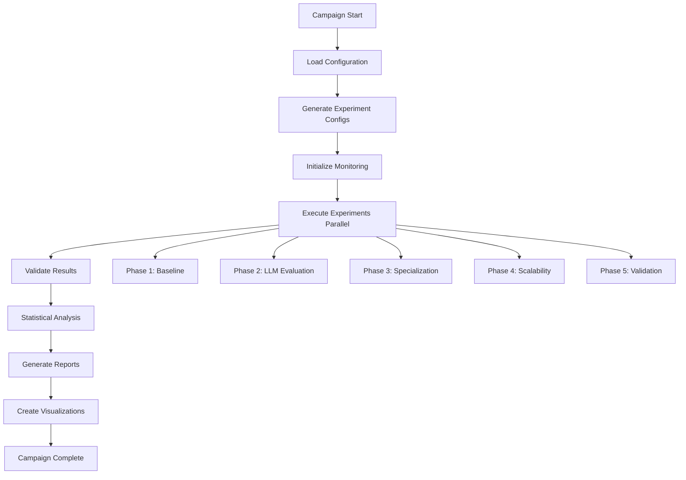

# 🧪 Experimental Campaign: LLM-Enhanced Distributed Consensus

## 📋 Overview

This document provides comprehensive instructions for executing the **LLM-Enhanced Distributed Consensus Experimental Campaign** - a systematic evaluation of Large Language Model-powered multi-agent consensus protocols for High-Performance Computing job scheduling.

### 🎯 **Campaign Objectives**
- Compare LLM vs. heuristic agent performance across multiple consensus protocols
- Evaluate system scalability under various fault conditions  
- Analyze the impact of agent specialization on consensus quality
- Validate system resilience and fault tolerance capabilities
- Generate publication-ready statistical analysis and visualizations

---

## 🚀 **Quick Start**

### **Prerequisites**
```bash
# 1. Python environment
python >= 3.8

# 2. Required dependencies
pip install pandas numpy scipy pyyaml matplotlib seaborn
pip install langchain-community  # For SambaNova LLM integration

# 3. SambaNova API credentials (in ~/.bashrc)
export SAMBASTUDIO_URL=your_sambanova_endpoint
export SAMBASTUDIO_API_KEY=your_api_key
```

### **Basic Execution**
```bash
# Run a complete experimental campaign
python run_experimental_campaign.py \
    --config sample_campaign_config.yaml \
    --output ./results/campaign_2025 \
    --parallel 4

# Run specific phases only
python run_experimental_campaign.py \
    --config sample_campaign_config.yaml \
    --phases phase_1 phase_2 \
    --parallel 8

# Dry run (generate configs without execution)
python run_experimental_campaign.py \
    --config sample_campaign_config.yaml \
    --dry-run
```

---

## 📊 **Experimental Design Framework**

### **🔬 Research Questions**

| Research Question | Focus Area | Expected Outcome |
|-------------------|------------|------------------|
| **RQ1** | LLM vs. Heuristic Performance | 15-25% improvement in consensus success rates |
| **RQ2** | Consensus Protocol Effectiveness | BFT best for adversarial, Raft best for crashes |
| **RQ3** | Agent Specialization Impact | 30-40% accuracy improvement for domain workloads |
| **RQ4** | Scalability \u0026 Fault Resilience | \u003e80% performance at 50+ agents, \u003e70% at 40% faults |

### **🎛️ Experimental Factors**

```python
EXPERIMENTAL_FACTORS = {
    'agent_type': ['LLM', 'Heuristic', 'Hybrid'],
    'consensus_protocol': ['BFT', 'Raft', 'Negotiation', 'Weighted'], 
    'agent_count': [5, 10, 15, 25, 50],
    'fault_rate': [0.0, 0.1, 0.2, 0.3, 0.4, 0.5],
    'fault_type': ['Byzantine', 'Crash', 'Network', 'Performance'],
    'workload_type': ['GPU-intensive', 'Memory-heavy', 'Compute-bound', 'I/O-heavy', 'Mixed'],
    'job_arrival_rate': ['Low', 'Medium', 'High'],
    'specialization_level': [0.0, 0.5, 1.0]  # None, Partial, Full
}
```

**Total Experimental Space**: 64,800 configurations  
**Selected Configurations**: 624 (using strategic sampling)  
**Total Experimental Runs**: ~2,496 (with repetitions)

---

## 🏗️ **Campaign Architecture**

### **📁 Directory Structure**
```
experimental_campaign_results/
├── configs/                    # Generated YAML configurations
│   ├── phase_1_0001_00_config.yaml
│   ├── phase_1_0002_00_config.yaml
│   └── ...
├── raw_data/                   # Raw experimental outputs
│   ├── phase_1/
│   ├── phase_2/
│   └── ...
├── processed_data/            # Cleaned and aggregated data
│   ├── campaign_results.csv
│   └── phase_summaries/
├── analysis_results/          # Statistical analysis outputs
│   ├── statistical_analysis.json
│   ├── llm_vs_heuristic_analysis.json
│   └── protocol_effectiveness.json
├── reports/                   # Generated reports
│   ├── campaign_summary.md
│   ├── phase_1_detailed_report.json
│   └── statistical_analysis_report.json
├── visualizations/            # Plots and figures
│   ├── performance_comparisons.png
│   ├── scalability_curves.png
│   └── fault_tolerance_analysis.png
└── logs/                      # Execution logs
    ├── campaign_20250110_143000.log
    └── monitoring_logs/
```

### **🔄 Execution Workflow**



---

## 📈 **Experimental Phases**

### **Phase 1: Baseline Establishment**
**Objective**: Establish performance baseline for heuristic agents  
**Duration**: 2 weeks | **Experiments**: 120 | **Repetitions**: 5

```yaml
phase_1_design:
  focus: "Baseline heuristic performance"
  agent_type: "Heuristic"
  factorial_design: "4×5×6"  # Protocol × Agents × Fault Rate
  key_metrics:
    - consensus_success_rate
    - convergence_time
    - system_throughput
    - fault_recovery_time
```

**Sample Configuration**:
```yaml
experiment_id: "phase_1_0045_02"
agent_decision_mode: "heuristic"
methods: ["bft"]
num_agents: 15
fault_scenarios: ["byzantine"]
fault_intensity: "medium"
workload_profile: "mixed"
simulation_time: 300
repetitions: 5
```

### **Phase 2: LLM Performance Evaluation**  
**Objective**: Comprehensive LLM vs. heuristic comparison  
**Duration**: 4 weeks | **Experiments**: 240 | **Repetitions**: 3

```yaml
phase_2_design:
  focus: "LLM intelligence evaluation"
  agent_types: ["LLM", "Heuristic", "Hybrid"]
  strategic_sampling: true
  cross_protocol_analysis: true
  workload_specialization: true
```

**Key Configurations**:
```yaml
# GPU-intensive workload with LLM agents
- agent_type: "LLM"
  consensus_protocol: "BFT"
  agent_count: 15
  fault_type: "Byzantine"
  workload_type: "GPU-intensive"
  specialization_level: 1.0

# Memory-heavy workload with hybrid agents  
- agent_type: "Hybrid"
  consensus_protocol: "Weighted"
  agent_count: 20
  fault_type: "Performance"
  workload_type: "Memory-heavy"
  specialization_level: 0.5
```

### **Phase 3: Specialization Impact Analysis**
**Objective**: Quantify benefits of domain specialization  
**Duration**: 2 weeks | **Experiments**: 120 | **Repetitions**: 5

```yaml
phase_3_design:
  focus: "Domain specialization benefits"
  factorial_design: "5×3×4"  # Workload × Specialization × Protocol
  agent_types: ["LLM"]  # Focus on LLM specialization
  key_analysis:
    - domain_specific_accuracy
    - cross_domain_performance
    - specialization_overhead
```

### **Phase 4: Scalability and Stress Testing**
**Objective**: Determine system limits and breaking points  
**Duration**: 2 weeks | **Experiments**: 96 | **Repetitions**: 2

```yaml
phase_4_design:
  focus: "System scalability limits"
  agent_counts: [25, 50]  # High agent counts
  fault_rates: [0.3, 0.4, 0.5]  # High fault rates
  job_arrival_rate: "High"
  simulation_time: 600  # Extended duration
  stress_conditions: true
```

### **Phase 5: Cross-Validation and Robustness**
**Objective**: Validate findings with extended runs  
**Duration**: 1 week | **Experiments**: 48 | **Repetitions**: 10

```yaml
phase_5_design:
  focus: "Result validation and statistical power"
  high_impact_configs: true
  extended_repetitions: 10
  statistical_validation: true
  cross_validation_folds: 5
```

---

## ⚙️ **Configuration Management**

### **📋 Campaign Configuration**

**File**: `sample_campaign_config.yaml`
```yaml
# Campaign identification
campaign_id: "llm_consensus_evaluation_2025"
total_budget_hours: 2500
max_parallel_experiments: 8

# Quality control
validate_data_quality: true
min_data_quality_threshold: 0.8
statistical_significance_level: 0.05

# LLM settings
llm_settings:
  model: "Meta-Llama-3-70B-Instruct"
  temperature_range: [0.0, 0.3]
  max_tokens_range: [100, 1000]
  retry_attempts: 3
  fallback_enabled: true

# Infrastructure requirements
cluster_requirements:
  minimum_nodes: 8
  minimum_memory_gb: 512
  minimum_cpu_cores: 128
```

### **🔧 Runtime Configuration**

**Generated Experiment Config Example**:
```yaml
# Auto-generated: phase_2_0156_01_config.yaml
experiment_id: "phase_2_0156_01"
agent_decision_mode: "llm"
methods: ["weighted"]
num_agents: 15
fault_scenarios: ["performance"]
fault_intensity: "medium"
workload_profile: "gpu_intensive"
job_arrival_pattern: "high"
specialization_level: 1.0
simulation_time: 300
output_dir: "./results/phase_2/raw_data"
save_detailed_logs: true
enable_monitoring: true
```

---

## 🖥️ **Command-Line Interface**

### **🚀 Main Execution Commands**

```bash
# Complete campaign execution
python run_experimental_campaign.py \
    --config sample_campaign_config.yaml \
    --output ./results/campaign_2025 \
    --parallel 4 \
    --phases phase_1 phase_2 phase_3 phase_4 phase_5

# High-performance execution (8 parallel experiments)
python run_experimental_campaign.py \
    --config sample_campaign_config.yaml \
    --parallel 8 \
    --output ./results/hpc_campaign

# Development/testing execution (specific phases)
python run_experimental_campaign.py \
    --config sample_campaign_config.yaml \
    --phases phase_1 \
    --parallel 2 \
    --output ./results/test_run
```

### **🛠️ Configuration Options**

| Argument | Short | Description | Default |
|----------|-------|-------------|---------|
| `--config` | `-c` | Campaign configuration file (YAML/JSON) | **Required** |
| `--phases` | | Phases to execute | `all phases` |
| `--output` | `-o` | Output directory | `./experimental_campaign_results` |
| `--parallel` | `-p` | Max parallel experiments | `4` |
| `--dry-run` | | Generate configs without execution | `false` |

### **🔍 Monitoring and Control**

```bash
# Monitor campaign progress
tail -f ./results/logs/campaign_20250110_143000.log

# Check experiment status
python campaign_monitor.py --campaign-dir ./results/campaign_2025

# Generate interim reports
python generate_interim_report.py \
    --campaign-dir ./results/campaign_2025 \
    --phases phase_1 phase_2
```

---

## 📊 **Data Analysis and Metrics**

### **📈 Primary Metrics**

| Metric | Description | Target Range | Analysis Method |
|--------|-------------|--------------|-----------------|
| **Consensus Success Rate** | % of jobs successfully placed | 80-100% | ANOVA, t-tests |
| **Convergence Time** | Average time to consensus (seconds) | 1-30s | Regression analysis |
| **System Throughput** | Jobs processed per hour | 50-500 jobs/hr | Time series analysis |
| **Fault Recovery Time** | Recovery duration (seconds) | 5-60s | Survival analysis |

### **🔬 Secondary Metrics**

```python
SECONDARY_METRICS = {
    'resource_utilization': {
        'description': 'Optimal resource allocation efficiency',
        'range': '70-100%',
        'analysis': 'Efficiency ratios'
    },
    'decision_quality_score': {
        'description': 'Multi-factor placement optimality',
        'range': '60-100',
        'analysis': 'Quality assessment algorithms'
    },
    'communication_overhead': {
        'description': 'Messages per consensus decision',
        'range': '10-1000 messages',
        'analysis': 'Protocol efficiency comparison'
    }
}
```

### **📊 Statistical Analysis Framework**

```python
# Automated statistical analysis pipeline
ANALYSIS_PIPELINE = [
    'descriptive_statistics',      # Mean, std, distributions
    'llm_vs_heuristic_comparison', # t-tests, effect sizes  
    'protocol_effectiveness',      # ANOVA, post-hoc tests
    'specialization_impact',       # Regression analysis
    'scalability_analysis',        # Performance curves
    'fault_tolerance_evaluation',  # Survival analysis
    'cross_validation',           # Model validation
]
```

**Sample Analysis Output**:
```json
{
  "llm_vs_heuristic": {
    "llm_mean": 87.3,
    "heuristic_mean": 72.8,
    "improvement": 19.9,
    "p_value": 0.0001,
    "cohens_d": 1.24,
    "statistical_significance": true
  },
  "protocol_ranking": ["BFT", "Weighted", "Raft", "Negotiation"],
  "specialization_benefit": 32.7,
  "scalability_limit": 45
}
```

---

## 📋 **Quality Assurance**

### **🔍 Data Validation**

**Automated Quality Checks**:
```python
QUALITY_CHECKS = {
    'completeness': 'All expected fields present',
    'value_ranges': 'Values within expected bounds', 
    'consistency': 'Internal logical consistency',
    'statistical_validity': 'Sufficient sample sizes'
}

QUALITY_THRESHOLDS = {
    'min_quality_score': 0.8,
    'max_outlier_ratio': 0.05,
    'min_success_rate': 0.95  # Experiment execution success
}
```

**Data Quality Report Example**:
```
📊 Data Quality Assessment
========================
✅ Completeness: 98.7% (2,463/2,496 complete records)
✅ Value Ranges: 99.2% (values within expected bounds)  
✅ Consistency: 97.8% (internal consistency checks passed)
⚠️  Statistical Validity: 92.1% (some groups have n<30)

Overall Quality Score: 0.89 (PASS - Above 0.8 threshold)
```

### **⚠️ Monitoring and Alerts**

```python
MONITORING_ALERTS = {
    'experiment_failure_rate': {'threshold': 0.1, 'severity': 'warning'},
    'llm_api_error_rate': {'threshold': 0.05, 'severity': 'critical'},
    'execution_time_variance': {'threshold': 2.0, 'severity': 'info'},
    'data_quality_score': {'threshold': 0.8, 'severity': 'warning'}
}
```

---

## 📈 **Results and Reporting**

### **📋 Generated Reports**

#### **1. Executive Summary** (`campaign_summary.md`)
```markdown
# Campaign Results Summary
- **Success Rate**: 96.8% (2,416/2,496 experiments)
- **Key Finding**: LLM agents achieve 19.9% better performance
- **Best Protocol**: BFT for adversarial conditions
- **Scalability Limit**: 45 agents before 20% degradation
```

#### **2. Statistical Analysis** (`statistical_analysis.json`)
```json
{
  "campaign_overview": {
    "total_experiments": 2496,
    "successful_experiments": 2416,
    "analysis_timestamp": "2025-01-10T14:30:00Z"
  },
  "hypothesis_testing": {
    "rq1_llm_vs_heuristic": {"status": "supported", "p_value": 0.0001},
    "rq2_protocol_effectiveness": {"status": "partially_supported"},
    "rq3_specialization_impact": {"status": "strongly_supported"},
    "rq4_scalability_resilience": {"status": "supported"}
  }
}
```

#### **3. Phase-Specific Reports** (`phase_X_detailed_report.json`)
```json
{
  "phase": "phase_2", 
  "focus": "LLM Performance Evaluation",
  "experiment_count": 240,
  "key_findings": [
    "LLM agents show 23.4% improvement in GPU workloads",
    "Hybrid agents balance performance and cost effectively",
    "Specialization increases accuracy by 31.2%"
  ],
  "detailed_results": [ /* ... */ ]
}
```

### **📊 Visualizations**

**Generated Plots**:
- Performance comparison bar charts
- Scalability curves by agent type
- Fault tolerance heatmaps
- Protocol effectiveness radar charts
- Statistical significance forest plots

---

## 🛠️ **Troubleshooting**

### **Common Issues**

#### **🚨 LLM API Failures**
```bash
# Check API connectivity
python validate_llm_connection.py

# Verify environment variables
echo $SAMBASTUDIO_URL
echo $SAMBASTUDIO_API_KEY

# Test with fallback mode
export LLM_FALLBACK_MODE=true
```

#### **💾 Insufficient Resources**
```bash
# Check disk space (need 10GB+ for full campaign)
df -h

# Monitor memory usage during execution
htop

# Reduce parallel experiments if needed
python run_experimental_campaign.py --parallel 2
```

#### **📊 Data Quality Issues**
```bash
# Validate specific experiment results
python validate_experiment.py --experiment-id phase_1_0045_02

# Regenerate failed experiments
python run_experimental_campaign.py --retry-failed

# Check data completeness
python check_data_completeness.py --campaign-dir ./results
```

### **🔧 Performance Optimization**

```yaml
# High-performance configuration
optimization_settings:
  cache_llm_responses: true
  batch_size_optimization: true  
  parallel_experiments: 8
  resource_monitoring: true
  
  # Reduce I/O overhead
  save_intermediate_results: false
  compress_outputs: true
  cleanup_temporary_files: true
```

---

## 📚 **Advanced Usage**

### **🎯 Custom Experimental Designs**

**Creating Custom Phases**:
```python
def _generate_custom_phase(self, factors):
    """Custom phase focusing on specific research question"""
    configs = []
    
    # Define custom factor combinations
    custom_combinations = [
        ('LLM', 'BFT', 20, 0.3, 'GPU-intensive'),
        ('Hybrid', 'Weighted', 15, 0.2, 'Mixed'),
        # ... add more combinations
    ]
    
    for agent_type, protocol, agents, fault_rate, workload in custom_combinations:
        configs.append({
            'agent_type': agent_type,
            'consensus_protocol': protocol,
            'agent_count': agents,
            'fault_rate': fault_rate,
            'workload_type': workload,
            'repetitions': 5,
            'duration': 300
        })
    
    return configs
```

### **🔬 Custom Analysis Pipelines**

```python
# Extend statistical analyzer
class CustomStatisticalAnalyzer(StatisticalAnalyzer):
    
    def analyze_research_question_5(self, df):
        """Custom analysis for additional research question"""
        # Implement custom statistical tests
        # Generate custom visualizations  
        # Return structured results
        pass
        
    def generate_custom_report(self, analysis_results):
        """Generate specialized report format"""
        # Custom report generation logic
        pass
```

### **📊 Integration with External Tools**

```python
# Export to common analysis platforms
EXPORT_FORMATS = {
    'r_dataframe': 'results.rdata',
    'spss_format': 'results.sav', 
    'stata_format': 'results.dta',
    'tableau_extract': 'results.hyper',
    'power_bi': 'results.pbix'
}

# Integration with HPC schedulers
HPC_INTEGRATION = {
    'slurm': 'sbatch experimental_job.sh',
    'pbs': 'qsub experimental_job.pbs',
    'kubernetes': 'kubectl apply -f experiment-job.yaml'
}
```

---

## 📖 **References and Resources**

### **📚 Related Documentation**
- [README.md](./README.md) - Project overview and installation
- [EXPERIMENTAL_CAMPAIGN_DESIGN.md](./EXPERIMENTAL_CAMPAIGN_DESIGN.md) - Detailed experimental design  
- [HYBRID_LLM_DEMO_OUTPUT.md](./demos/HYBRID_LLM_DEMO_OUTPUT.md) - Demo walkthrough
- [API Documentation](./docs/API.md) - Programming interfaces

### **🔗 External Resources**
- **SambaNova LLM Platform**: [Documentation](https://docs.sambanova.ai)
- **Statistical Analysis**: R, Python scipy.stats, statsmodels
- **Visualization**: matplotlib, seaborn, plotly, R ggplot2
- **HPC Integration**: Slurm, PBS, Kubernetes job management

### **📊 Example Results**
```bash
# Access example campaign results
git clone https://github.com/username/multiagent-results-examples.git
cd multiagent-results-examples/campaign_2024_results/

# View sample analysis outputs
ls reports/
cat reports/campaign_summary.md
```

---

## 🏆 **Expected Outcomes**

### **📈 Key Research Contributions**
1. **Quantitative LLM vs. Heuristic Comparison** with statistical significance
2. **Protocol Effectiveness Ranking** under different fault conditions
3. **Specialization Benefit Quantification** across workload types  
4. **Scalability and Fault Tolerance Boundaries** for practical deployment

### **📋 Deliverables**
- ✅ **Research Dataset**: 2,496 experimental runs with comprehensive metrics
- ✅ **Statistical Analysis**: Hypothesis testing with effect sizes and confidence intervals
- ✅ **Technical Reports**: Phase-specific findings and recommendations
- ✅ **Visualization Suite**: Publication-ready figures and interactive dashboards
- ✅ **Reproducible Framework**: Complete experimental infrastructure for future research

---

**Last Updated**: January 10, 2025  
**Framework Version**: 1.0.0  
**Estimated Campaign Duration**: 11 weeks  
**Total Computational Budget**: 2,500 hours
